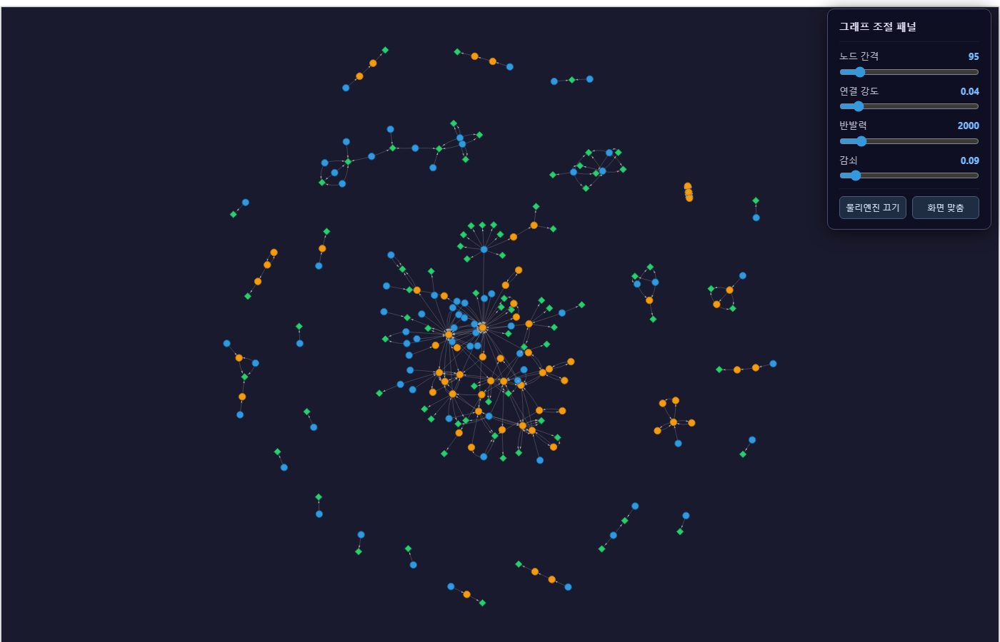
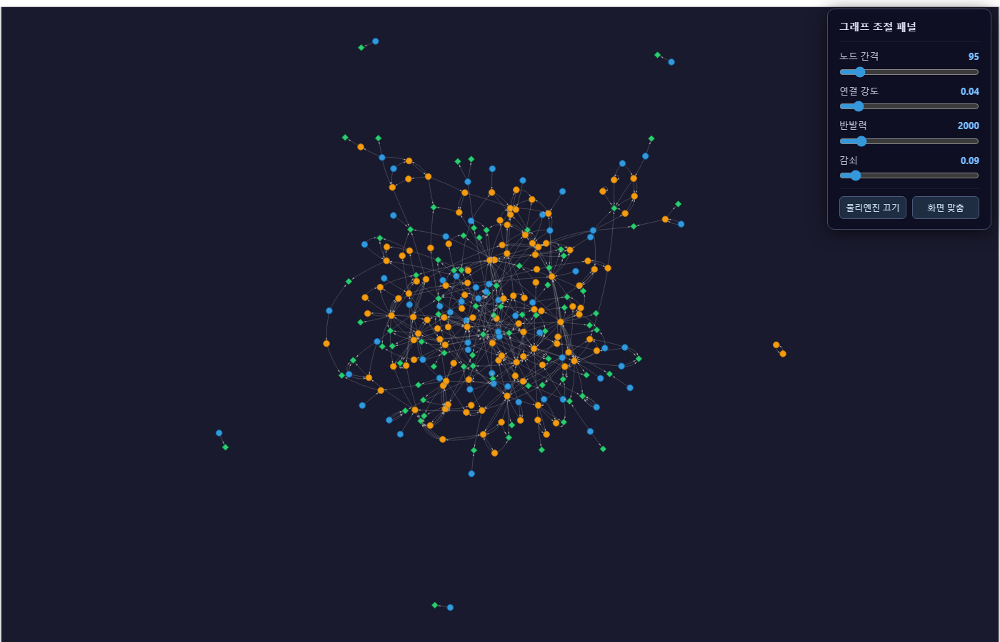

# 주택금융공사 규정 지식그래프(KG) 및 LLM 연동 프로젝트

## 프로젝트 개요
**기존 상황**: 주택금융공사 고객 민원(VOC) 응답은 담당자가 복잡한 대출 및 보증 규정(보금자리론, 디딤돌 대출 등)을 일일이 검토하여 문의글을 직접 응답해왔음.

**프로젝트 목표**: 이러한 **수동 응답 프로세스를 LLM 기반 자동화 시스템으로 보조**하기 위해, **금융 조건 특화 온톨로지(Ontology)** 와 **지식그래프(Knowledge Graph)** 를 도입하여 정확한 응답 생성 시스템 구축.

## 문제 정의 및 해결

1. **텍스트 청크 기반 RAG(Naive RAG)의 한계 극복**
   기존 RAG는 **논리적 관계를 활용하지 못하고 키워드 매칭 수준의 텍스트 청크를 찾는 경우가 많음**. 
   
   이를 극복하기 위해 **지식그래프(Knowledge Graph)를 도입**하여 핵심 개념들을 노드로, 노드 간 논리적 관계를 엣지로 모델링.

2. **온톨로지 설계: 지식그래프의 구조화와 일관성 확보**
   단순히 KG를 구축하면 LLM이 노드와 엣지를 무분별하게 생성해 **"같은 개념이 여러 이름으로 표현되고, 그래프 구조의 일관성 저하**로 이어짐. 이를 방지하기 위해  **온톨로지를 설계**하고 이를 기반으로 KG 생성

3. **앙상블 RAG: 지식그래프와 텍스트 청크의 상보적 활용**
   지식그래프는 **관계 추론에 강하지만 세부적인 맥락, 자세한 내용을 완전히 표현하기 어려움**. 텍스트 청크는 **원문의 맥락, 내용은 풍부하게 표현 가능하지만 구조적 추론에 약함**. 이 두 강점을 모두 살리기 위해:
   - **검색 단계**: **KG 기반 Retriever**, **텍스트 기반 Retriever**을 모두 활용하여 상호 장단점 보완
   - **병합 단계**: RRF(Reciprocal Rank Fusion) 알고리즘으로 두 검색 결과를 결합
   - **생성 단계**: LLM이 지식그래프와 원문의 세부 조건을 함께 해석해 정확한 답변 생성

## 성능 평가 및 결과

### 최신 평가 

디딤돌 대출·보금자리론 **2개 문서**에 대해 Golden Dataset(20개 문항)을 기준으로 Ragas(LLM as a Judge)로 정량 평가함.

| 모델 / 방식 | Answer Relevancy | Faithfulness | Context Precision | Answer Correctness (정답률) |
|---|:---:|:---:|:---:|:---:|
| **Naive RAG** | 0.4498 | 0.6875 | **0.7945** | 0.5934 |
| **Ensemble RAG** (Naive + 일반 KG) | 0.4994 | 0.6170 | 0.6767 | **0.6496** |
| **Ensemble RAG** (Naive + 온톨로지 KG) | **0.5273** | **0.7649** | **0.7900** | **0.6466** |

### 최종 결과 해석

- **Answer Correctness** (정답률)
  - Ensemble RAG가 Naive RAG 대비 **+9%** 향상
  - KG 기반 조건 경로 탐색이 복잡한 규정 추론에 기여

- **Faithfulness** (환각 억제)
  - 일반 KG 추가 시 0.617로 Naive RAG(0.688)보다 **오히려 하락** — 노이즈 있는 KG는 역효과
  - 온톨로지 도입으로 0.765까지 회복 → 일반 KG 대비 **+24%** 향상
  - 온톨로지가 KG 노이즈를 제거하여 LLM 환각을 억제함을 수치로 입증

- **Context Precision** (검색 정밀도)
  - 일반 KG 추가 시 0.794 → 0.677로 하락 — 넓은 검색 범위로 노이즈 유입
  - 온톨로지 도입으로 0.790까지 회복(**+16.7%**) — 구조화된 스키마가 검색 노이즈 해소

- **종합** (4개 지표 평균)
  - 온톨로지 KG Ensemble **0.682** > Naive RAG **0.631** > 일반 KG Ensemble **0.611**
  - Naive RAG 대비 평균 **+8.1%** 향상
  - 일반 KG가 Naive RAG보다 낮다는 점 → 온톨로지 없는 KG 도입은 오히려 역효과


## 지식그래프 구조

### 생성된 지식그래프 시각화

**온톨로지 기반 KG** — Schema로 일관되게 구축, 노드·엣지 타입 명확 (디딤돌+보금자리론 2개 문서)
[](https://zhdhfhd33.github.io/KG_LLM/data/kg_visuals/kg_graph_ontology_2docs.html)
> [인터랙티브 버전 열기 →](https://zhdhfhd33.github.io/KG_LLM/data/kg_visuals/kg_graph_ontology_2docs.html)

**일반 KG (온톨로지 없음)** — 자유도 높게 생성, 구조 파편화·동의어 난립 문제 확인 가능 (동일 2개 문서)
[](https://zhdhfhd33.github.io/KG_LLM/data/kg_visuals/kg_graph_without_ontology_2docs.html)
> [인터랙티브 버전 열기 →](https://zhdhfhd33.github.io/KG_LLM/data/kg_visuals/kg_graph_without_ontology_2docs.html)

### 온톨로지 도입으로 해결된 두 가지 핵심 문제

#### 문제 1: 동의어 파편화 — 같은 개념이 다른 노드로 분리

온톨로지 없이 생성하면 LLM이 띄어쓰기·표기를 매번 다르게 써서 **같은 상품이 별개의 노드**가 된다.

**Before (일반 KG)** — `내집마련 디딤돌 대출`이 표기 차이로 3개 노드로 쪼개짐:

```
(내집마련 디딤돌 대출) --[공급]--> (주택도시기금 직접대출방식)
(내집마련 디딤돌대출)  --[준용]--> (제1장∼제10장)
(내집마련디딤돌대출)   --[Is based on]--> (주택도시기금운용및관리규정)
```

> "디딤돌 대출 공급 방식"을 검색하면 첫 번째 노드의 엣지만 보임. 나머지 두 노드에 달린 규정·조건 정보는 누락된다.

**After (온톨로지 KG)** — 동의어 사전 구축:

```
(디딤돌대출) --[신청가능]--> (디딤돌대출_대출재원_주택도시기금)
(디딤돌대출) --[관련]------> (구입용도)
(디딤돌대출) --[관련]------> (디딤돌대출_유한책임대출_LTV_70%)
```

> 모든 엣지가 단일 `디딤돌대출` 노드에 집중 → 검색 시 누락 없음.

---

#### 문제 2: 복합 조건 표현 불가 — AND/OR 논리를 그래프로 담지 못함

대출 규정에는 다음과 같은 **복합 조건** 문장이 자주 등장한다.

> 원본 규정: "**신혼가구이면서 생애최초 주택구입자인 경우에 한해** 우대금리 0.3%p를 적용한다."

이 문장의 핵심은 "A **이면서** B인 경우에만 C 적용", 즉 두 조건이 **모두** 충족돼야 하는 AND 논리다. 그런데 일반 KG는 이 문장을 노드·엣지로 쪼개는 순간 AND 관계를 표현할 방법이 없어, 각 조건이 서로 독립적인 엣지로 흩어진다. 그 결과 한쪽 조건만으로도 잘못된 경로를 타고 검색될 수 있다.

**Before (일반 KG)** — 위 문장을 변환하면 조건들이 각각 별개 엣지로 분산됨:

```
(신혼가구)        --[우대금리]--------> (0.3%p)
(생애최초 신혼가구) --[중복적용 가능]--> (우대금리)
```

> "신혼가구이면서 생애최초인 경우에만 0.3%p" 라는 AND 조건이 사라짐.  
> "신혼가구"만으로도 0.3%p가 검색될 수 있어 잘못된 답변 유발.

**After (온톨로지 KG)** — `cond_AND` 노드로 명시적 논리 구조 표현:

```
(cond_AND_신혼가구_생애최초_우대금리) --[조건_AND]--> (신혼가구)
(cond_AND_신혼가구_생애최초_우대금리) --[조건_AND]--> (생애최초주택구입자)
(cond_AND_신혼가구_생애최초_우대금리) --[결과적용]--> (신혼가구_보금자리론_우대금리_0.3%p)
```

> "신혼 AND 생애최초 → 우대금리 0.3%p"가 명확한 그래프 경로로 표현됨.  
> 조건 중 하나라도 빠지면 결과에 도달하는 경로 자체가 존재하지 않음.

이 두 문제가 Faithfulness(환각 억제) 지표에 직접 영향을 준다. 일반 KG 추가 시 0.617로 **하락**했다가, 온톨로지 도입 후 0.765로 **회복**한 것이 이를 수치로 뒷받침한다.


## 실행 방법

```bash
# 패키지 설치 (config.md에 OPENAI_API_KEY 입력 필요)
pip install -r requirements.txt

# KG 구축 (--two: 디딤돌+보금자리론 2개 문서만, 성능 표 기준)
python src/kg/build_kg.py --two            # 일반 KG → data/kg_store/kg_store_2docs.json
python src/kg/build_kg_ontology.py --two   # 온톨로지 KG → data/kg_store/kg_store_ontology_2docs.json

# Baseline 평가 (성능 표 기준 3가지)
python src/pipeline/evaluate.py --naive --two    # Naive RAG
python src/pipeline/evaluate.py --two            # Ensemble RAG (Naive + 일반 KG)
python src/pipeline/evaluate.py --ensemble --two # Ensemble RAG (Naive + 온톨로지 KG, RRF)

# 챗봇 대시보드
streamlit run src/pipeline/app.py    # http://localhost:8501
```